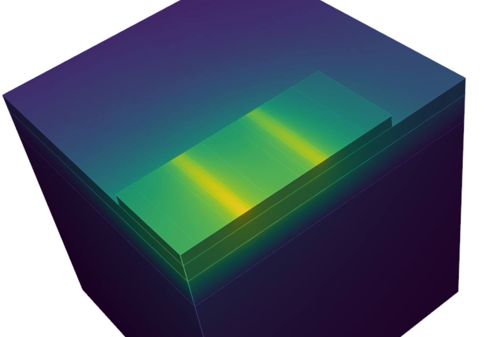

# HotHEMT
This package uses open-source tools to simulate thermal resistances for HEMT structures.  Specifically [gmsh](https://gmsh.info/) is used to create 3-D meshes and [SFEpy](https://sfepy.org) is used to solve the Finite-Element problem on the mesh.

The self-heating is handled by simply assuming heaters of specified size at the drain-edge of the gate.

Have a look at [example.py](examples/example.py) in `examples/` to start producing 3D simulations like this and see how much your HEMT will heat up:

Note: in case of issues running based on the loose requirements in pyproject.toml (e.g. "ndarray is not C-contiguous"), a stricter requirements.txt is provided for a working installation, though this make install some unnecessary packages (such as Jupyter) that happened to be in the frozen working installation environment.  TODO: Root-cause and tighten pyproject.toml.